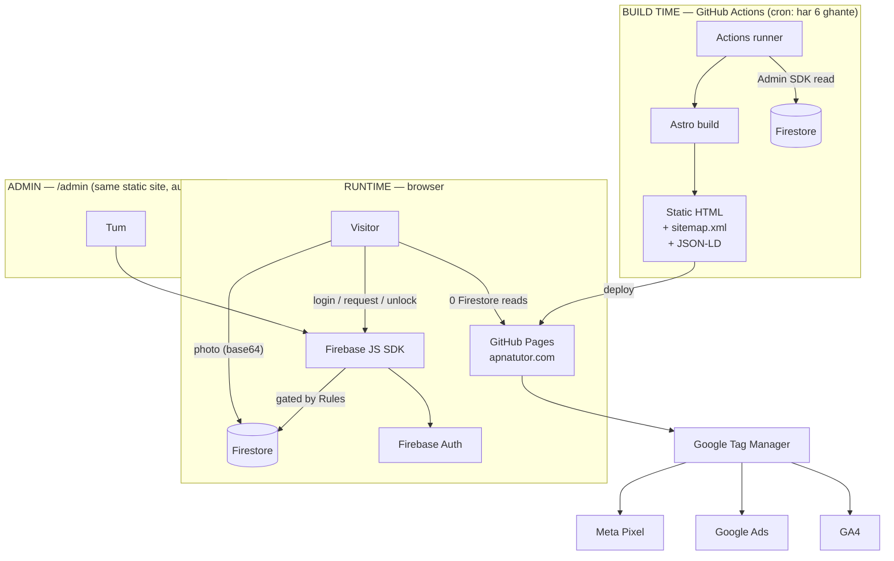

# ApnaTutor — Architecture

**Version:** 1.0 · **Target:** production launch, Risalpur + Nowshera
**Stack:** Astro (SSG) → GitHub Pages · Firebase Spark (free) — aur kuch nahi

---

## 1. Hard constraints (ye poora design inhi se nikla hai)

Firebase ka free **Spark** plan 2026 mein pehle jaisa nahi hai. Ye teen cheezein
**available nahi** hain, aur inke aas paas design karna para hai:

| Band hai | Kab se | Asar |
|---|---|---|
| **Cloud Storage** | 3 Feb 2026 — Blaze zaroori, default bucket bhi | Photos Firestore mein base64 ke taur par (neeche §3 dekho) |
| **Cloud Functions** | Cloud Run / Build / Artifact Registry Spark par "Not applicable" | **Koi server-side code nahi** → saara logic client + Security Rules |
| **Phone OTP (SMS)** | Sep 2024 — billing account zaroori; sirf 10 SMS/day bill-free | Automated OTP nahi → manual phone check |

Jo free mein milta hai aur kaafi hai:

- **Firestore** — 1 GiB storage, 50,000 reads/day, 20,000 writes/day, 20,000 deletes/day
- **Auth** — Email/password + Google sign-in, 50,000 MAU tak
- **Analytics + FCM** — unlimited
- **App Check** — free (anti-scraping ke liye ahem)

### Sabse ahem consequence: "no server" ka matlab

Jo cheezein normally Cloud Function karta, wo yahan **Firestore Security Rules**
karengi. Rules hi tumhara backend hain. Isliye `firestore.rules` is project ki
sabse important file hai — code se zyada. Usay halke mein na lena.

Jo cheezein is architecture mein **nahi ho sakti** (aur unka free jugaar):

| Chahiye | Function ke bagair | Jugaar |
|---|---|---|
| Tutor ko email/SMS notification | ❌ | In-app leads inbox + admin manually WhatsApp |
| Ratings ka auto-average | ❌ | Admin review approve karte waqt recompute karta hai |
| Server-side rate limiting | ❌ | App Check + Rules mein query limit cap |
| Custom auth claims (admin role) | ❌ | `admins/{uid}` document + Rules `exists()` check |
| Payment webhooks | ❌ | Phase 2 — manual bank transfer + admin flag |

---

## 2. System diagram



### Design ka core insight

**Browsing se Firestore par ek bhi read nahi hota.** Saare tutor profiles, city
pages aur subject pages build time par static HTML ban jate hain, data andar baked
hota hai. Visitor sirf files download karta hai.

Firestore sirf tab chalta hai jab koi **logged-in action** ho — request post karna,
contact unlock karna, tutor registration, admin panel. Isliye 50,000 reads/day
free limit real traffic par bilkul kaafi hai.

Trade-off: naya tutor sign-up karne ke baad **agli build tak** (max 6 ghante)
static pages par nahi aata. Admin panel se manual rebuild trigger kar sakte ho
(GitHub Actions → Run workflow), to approval ke foran baad live kar sakte ho.

---

## 3. Firestore data model

### `users/{uid}`
Har logged-in banda. Role yahan hai, lekin user isay khud badal nahi sakta.

```
role         : 'parent' | 'tutor'        // 'admin' kabhi client se set nahi hota
name         : string
city         : string
createdAt    : timestamp (serverTimestamp)
```

### `admins/{uid}`
Sirf existence matter karti hai. **Ye documents Firebase Console se haath se
banao** — koi client inhe likh nahi sakta. Rules isi se admin check karti hain.

```
email     : string      // sirf reference ke liye
addedAt   : timestamp
```

### `tutors/{uid}` — public profile
Ye duniya padh sakti hai (sirf `status == 'approved'` wale). **Yahan phone number
kabhi nahi aata.**

```
slug            : string     // "muhammad-ali-risalpur" — unique, URL ke liye
name            : string
gender          : 'male' | 'female'
city            : string     // "nowshera"
areas           : string[]   // ["risalpur", "nowshera-city"]
subjects        : string[]   // ["mathematics", "physics"]
classes         : string[]   // ["9", "10", "fsc"]
boards          : string[]   // ["fbise", "kpk", "olevel"]
modes           : string[]   // ["home", "online"]
feeMin          : number     // 3000
feeMax          : number     // 6000
qualification   : string     // "MSc Mathematics"
experienceYears : number
availability    : string     // "Mon–Sat, 4 PM – 9 PM"
bio             : string     // max 600 chars
photoUrl        : string|null      // build time par `photos/{uid}` se aata hai
status          : 'pending' | 'approved' | 'rejected' | 'suspended'
badges          : {                 // SIRF admin likh sakta hai
                    phoneChecked : bool
                    idChecked    : bool
                    qualChecked  : bool
                  }
ratingAvg       : number     // SIRF admin (review approve karte waqt)
ratingCount     : number     // SIRF admin
featuredUntil   : timestamp|null   // SIRF admin
createdAt       : timestamp
updatedAt       : timestamp
reviewedAt      : timestamp|null   // approval ke waqt — "edited since approval" detect karne ko
```

> **`fullyVerified` field nahi hai — jaan boojh kar.** "ApnaTutor Verified" badge
> UI mein `phoneChecked && idChecked && qualChecked` se derive hota hai. Ek alag
> field rakhne se wo teeno se out-of-sync ho sakti thi, aur tumhara core rule
> ("jo verify nahi hua us par badge nahi") toot jata.

### `tutors/{uid}/private/contact` — gated
Alag document, kyunki Firestore Rules **field-level** nahi, **document-level**
hoti hain. Phone ko chhupane ka yahi tareeqa hai.

```
phone      : string     // "+923001234567"
whatsapp   : string
email      : string
```
Read access: khud tutor, admin, ya wo parent jiska `connections/` doc mojood hai.

### `connections/{parentUid}_{tutorUid}` — contact unlock ka record
Document ID hi composite hai, isliye ek pair ka ek hi record ban sakta hai.

```
parentUid  : string
tutorUid   : string
source     : 'search' | 'lead'
createdAt  : timestamp
```
Ye record do kaam karta hai: contact unlock, aur **review likhne ka haq** (review
sirf tabhi ban sakta hai jab connection mojood ho).

### `requests/{requestId}` — parent ki tuition request
Private. Sirf parent aur admin padh sakte hain.

```
parentUid   : string
parentPhone : string      // yahan safe hai — public read nahi
classLevel  : string
subject     : string
city        : string
area        : string
mode        : 'home' | 'online' | 'any'
genderPref  : 'male' | 'female' | 'any'
budgetMax   : number
timing      : string
notes       : string
status      : 'open' | 'matched' | 'closed'
createdAt   : timestamp
```

### `leads/{leadId}` — fan-out, tutor ke dashboard ke liye
Ek request se 3–5 lead docs bante hain, har matched tutor ke liye ek. **Parent ka
phone aur address is document mein kabhi nahi hota** — Rules isay enforce karti hain.

```
requestId   : string
parentUid   : string
tutorUid    : string
classLevel  : string
subject     : string
area        : string
mode        : string
budgetMax   : number
timing      : string
status      : 'new' | 'interested' | 'declined'
createdAt   : timestamp
respondedAt : timestamp|null
```

Fan-out kaun karta hai? **Parent ka browser.** Request banane ke baad client
matching approved tutors query karta hai (public data) aur max 5 lead docs likhta
hai. Server ke bagair yahi tareeqa hai.

### `reviews/{parentUid}_{tutorUid}`
Composite ID = ek parent ek tutor ko ek hi review de sakta hai.

```
tutorUid   : string
parentUid  : string
parentName : string
rating     : int 1–5
text       : string
status     : 'pending' | 'approved' | 'rejected'
createdAt  : timestamp
```

### `reports/{autoId}`
```
reporterUid : string
targetType  : 'tutor' | 'review' | 'request'
targetId    : string
reason      : string
detail      : string
status      : 'open' | 'actioned' | 'dismissed'
createdAt   : timestamp
```

### `photos/{tutorUid}` — approve ho chuki profile photo

Cloud Storage istemal nahi hoti (Spark par available bhi nahi), aur koi bahar
ki service bhi nahi — poora backend Firebase hai. Isliye photo Firestore mein
hi rehti hai, base64 data URI ke taur par.

```
dataUrl    : string     // 600px JPEG — sirf tutor ki apni profile page par
thumbUrl   : string     // 96px JPEG — tutor cards par
updatedAt  : timestamp
```

**Alag collection kyun?** Agar photo `tutors/{uid}` mein hoti to har search
query (30 docs) ke saath 30 photos bhi download hotin. Alag rakhne se public
tutor doc halka rehta hai, aur build script build ke waqt dono ko jor deta hai.

**Do size kyun?** Ek city page par 30 cards hote hain. 600px wali photo har
card par hoti to page 2.4 MB ka ban jata; 96px thumbnail (~6 KB) se wo page
76 KB rehta hai.

Photo browser mein hi simat jati hai (canvas par), isliye koi server ya
transformation service nahi chahiye. Tutor `tutors/{uid}/private/photoSubmission`
mein bhejta hai; admin dekh kar `photos/{uid}` mein laata hai — yani photo bhi
usi trust rule ke tehat hai jaise badges.

### `cities/{citySlug}` aur `subjects/{subjectSlug}` — SEO content
World-readable, sirf admin likhta hai. Build script inhe padh kar pages banata hai.

```
// cities/risalpur
name        : "Risalpur"
nameUrdu    : "رسالپور"
district    : "Nowshera"
province    : "KPK"
areas       : ["Risalpur Cantt", "Risalpur City", "Taru Jabba"]
intro       : string    // 2–3 unique paragraphs, har city ke liye alag
```

---

## 4. Required Firestore indexes

`firestore.indexes.json` mein ye composite indexes chahiye:

| Collection | Fields | Kis query ke liye |
|---|---|---|
| tutors | `status` ASC, `city` ASC, `subjects` ARRAY, `featuredUntil` DESC | city + subject search |
| tutors | `status` ASC, `city` ASC, `updatedAt` DESC | city listing |
| tutors | `status` ASC, `updatedAt` DESC | admin approval queue |
| leads | `tutorUid` ASC, `status` ASC, `createdAt` DESC | tutor leads inbox |
| leads | `requestId` ASC, `status` ASC | parent ko interested tutors |
| requests | `parentUid` ASC, `createdAt` DESC | parent dashboard |
| reviews | `tutorUid` ASC, `status` ASC, `createdAt` DESC | profile par reviews |
| reviews | `status` ASC, `createdAt` DESC | admin moderation queue |
| reports | `status` ASC, `createdAt` DESC | admin reports queue |

### Search query ki ek asli limitation

Firestore ek query mein **sirf ek `array-contains`** allow karta hai. Iska matlab
subject + class + area teeno ko ek saath server-side filter nahi kar sakte.

**Design:** query sirf teen cheezon par karo —

```js
where('status', '==', 'approved')
where('city', '==', city)
where('subjects', 'array-contains', subject)
orderBy('featuredUntil', 'desc')
limit(30)
```

— aur class, area, fee, gender ka filter **client-side** karo. Phase 1 mein ek
city mein 30–300 tutors honge, to ye tez aur sasta hai.

Jab ek city mein 500+ tutors ho jayein, tab Algolia ya Typesense ke free tier par
move karna hoga. Usse pehle ki zarurat nahi.

---

## 5. Quota math — kya ye free tier mein chalega?

Maan lo mehnat kaamyab ho gayi: **din ke 2,000 visitors, 300 tutors, 40 requests/day.**

**Reads:**

| Kaam | Reads |
|---|---|
| 2,000 log browsing (static HTML) | **0** |
| 40 requests × ~35 reads (matching query + rules `get()`) | 1,400 |
| 60 contact unlocks × ~4 | 240 |
| 30 tutors apne leads dekh rahe × ~15 | 450 |
| Admin panel poora din | ~2,000 |
| 4 builds × 350 docs | 1,400 |
| **Total** | **≈ 5,500 / 50,000** |

**Writes:**

| Kaam | Writes |
|---|---|
| 40 requests × (1 request + 5 leads) | 240 |
| 60 connections | 60 |
| 10 naye tutor profiles + edits | ~40 |
| Lead responses, reviews, admin updates | ~150 |
| **Total** | **≈ 490 / 20,000** |

**Storage:** 300 tutor docs × ~2 KB = 600 KB. 1 GiB ka 0.06%.

Nateeja: free tier is scale par **11% se bhi kam** use hoga. Jo cheez pehle
tootegi wo quota nahi — **tumhara manual verification ka waqt** hoga.

### Kab paisa lagega

- **Firestore limit** — jab din ke ~15,000 logged-in actions hon. Bohat door hai.
- **Firestore storage** — 1 GiB free. Ek photo (thumb + full) taqreeban 100 KB
  leti hai, yani ~10,000 profiles. Bohat door hai.
- **Pehla asli kharcha** — jab SMS OTP chahiye hoga (Blaze) ya paid featured
  listings ke liye payment gateway. Dono Phase 3 ki baatein hain.

---

## 6. Repo structure

```
apnatutor/
├─ .github/workflows/deploy.yml      # build + deploy, cron har 6 ghante
├─ firestore.rules                    # ★ backend yahi hai
├─ firestore.indexes.json
├─ astro.config.mjs
├─ package.json
├─ public/
│  ├─ CNAME                           # apnatutor.com
│  ├─ .nojekyll
│  ├─ robots.txt
│  └─ favicon.svg
├─ scripts/
│  ├─ fetch-data.mjs                  # build time: Firestore → JSON
│  └─ validate-seo.mjs                # thin pages block karta hai
├─ src/
│  ├─ layouts/Base.astro              # <head>, GTM, JSON-LD slot
│  ├─ components/                     # TutorCard, Badges, SearchForm, ...
│  ├─ lib/
│  │  ├─ firebase.ts                  # client SDK init + App Check
│  │  ├─ queries.ts                    # saari Firestore queries ek jagah
│  │  └─ analytics.ts                  # dataLayer event helpers
│  ├─ styles/tokens.css               # design tokens (index.html se)
│  └─ pages/                          # routes — 02-PAGES-SPEC.md dekho
└─ docs/                              # ye documentation
```

---

## 7. Faisle jo already ho chuke — inhe na badlo

1. **Phone number public doc mein kabhi nahi.** Warna ek scraper script saare
   tutors ke numbers 5 minute mein utha lega, aur wo numbers phir spam/fraud ke
   liye bikte hain. Ye is platform ka sabse bara data risk hai.
2. **Verification documents (CNIC, degree) kahin store nahi honge.** Sirf boolean
   flags. Wajah `05-RISKS.md` §2 mein hai — ye sirf technical nahi, legal masla hai.
3. **Trust badges sirf admin likh sakta hai.** Rules mein hard-coded. Agar tutor
   apna badge set kar sake to poora trust system bekaar hai.
4. **Review sirf `connections/` doc ke baad.** Rules enforce karti hain. Ye fake
   reviews ke khilaf sabse asaan aur mazboot defence hai.
5. **Koi demo/seed/placeholder data nahi.** Count zero ho to UI "abhi koi tutor
   nahi" dikhaye — jhooti sankhya nahi.
